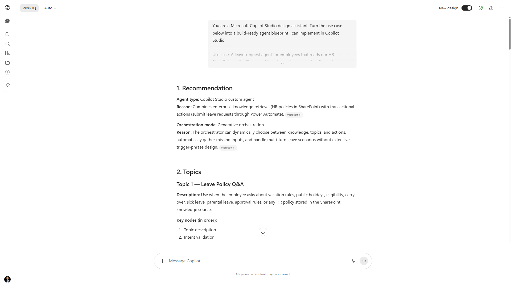

# Agent topic blueprint



## Summary

This prompt turns a one-line use case into a build-ready Microsoft Copilot Studio agent blueprint: an agent-type and orchestration recommendation, topics with selection-friendly descriptions and node flows, tools and actions, knowledge sources, variables, an Adaptive Card welcome, security and cost notes, and a first test plan. It gives a maker a concrete starting structure to implement in Copilot Studio instead of a blank canvas.

## Prompt

```
You are a Microsoft Copilot Studio design assistant. Turn the use case below into a build-ready agent blueprint I can implement in Copilot Studio.

Use case: [describe the agent in one or two sentences: who uses it, what it does, and what data or systems it needs]

Produce the blueprint in exactly these sections:

1. Recommendation. State the agent type (declarative, custom, or custom engine) and orchestration mode (generative or classic), each with a one-line reason. Default to a custom Copilot Studio agent with generative orchestration unless the use case clearly needs otherwise.

2. Topics. List 3 to 7 topics. For each, give: a name, a one-line generative-orchestration description that names the task and includes "use when", and the key nodes in order (Question, Condition, Message, Call tool, and so on). Note any input the topic must collect.

3. Tools and actions. List the tools or Power Automate flows the agent needs. For each: name, description written for orchestrator selection, typed inputs and outputs, and the failure path.

4. Knowledge. List the knowledge sources to attach and the scope of each. Note when knowledge should answer versus when a topic or tool should.

5. Variables. List the global variables the agent needs, with type and purpose.

6. Welcome experience. Provide a valid Adaptive Card JSON for conversation start with a short greeting and 3 starter prompts drawn from the topics above.

7. Security and cost. State the authentication mode to use (None, Microsoft Entra, or generic OAuth 2.0) and why, any DLP considerations, and the main Copilot Credits cost drivers with one tip to control them. Use Copilot Credits terminology, not messages.

8. First test plan. Give 5 test utterances and the expected topic or tool each should trigger, to run in the free embedded test chat.

Rules: be specific and build-ready. Do not invent product features or menu paths. If a detail depends on current product behavior, say so and point me to Microsoft Learn. Do not use the em dash character.
```

### Description

Replace the bracketed use case with your own, then run the prompt in Microsoft 365 Copilot. It returns all eight sections, including a valid Adaptive Card JSON welcome and a five-utterance test plan, ready to translate into topics and tools in Copilot Studio. Pair it with the Copilot Studio Test Planner skill to expand the five starter tests into a full graded suite once the agent is built.

## Contributors

[Elliot Margot](https://github.com/OwnOptic)

## Version history

Version|Date|Comments
-------|----|--------
1.0|Jul 14, 2026|Initial release

## Instructions

1. Make sure you have Microsoft 365 Copilot in your tenant.
2. Open Microsoft 365 Copilot Chat (or the Copilot app in Microsoft Teams).
3. Paste the prompt, replacing the bracketed use case with your scenario.
4. Review the blueprint and implement the topics, tools, and welcome card in [Microsoft Copilot Studio](https://copilotstudio.microsoft.com/).

## Prerequisites

* [Microsoft 365 Copilot](https://www.microsoft.com/microsoft-365/copilot)

## Help

We do not support samples, but this community is always willing to help, and we want to improve these samples. We use GitHub to track issues, which makes it easy for community members to volunteer their time and help resolve issues.

You can try looking at [issues related to this sample](https://github.com/pnp/copilot-prompts/issues?q=label%3A%22sample%3A%20agent-topic-blueprint%22) to see if anybody else is having the same issues.

If you encounter any issues using this sample, [create a new issue](https://github.com/pnp/copilot-prompts/issues/new).

Finally, if you have an idea for improvement, [make a suggestion](https://github.com/pnp/copilot-prompts/issues/new).

## Disclaimer

**THIS CODE IS PROVIDED *AS IS* WITHOUT WARRANTY OF ANY KIND, EITHER EXPRESS OR IMPLIED, INCLUDING ANY IMPLIED WARRANTIES OF FITNESS FOR A PARTICULAR PURPOSE, MERCHANTABILITY, OR NON-INFRINGEMENT.**


