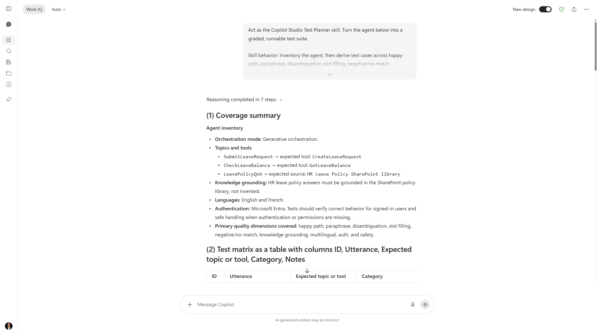
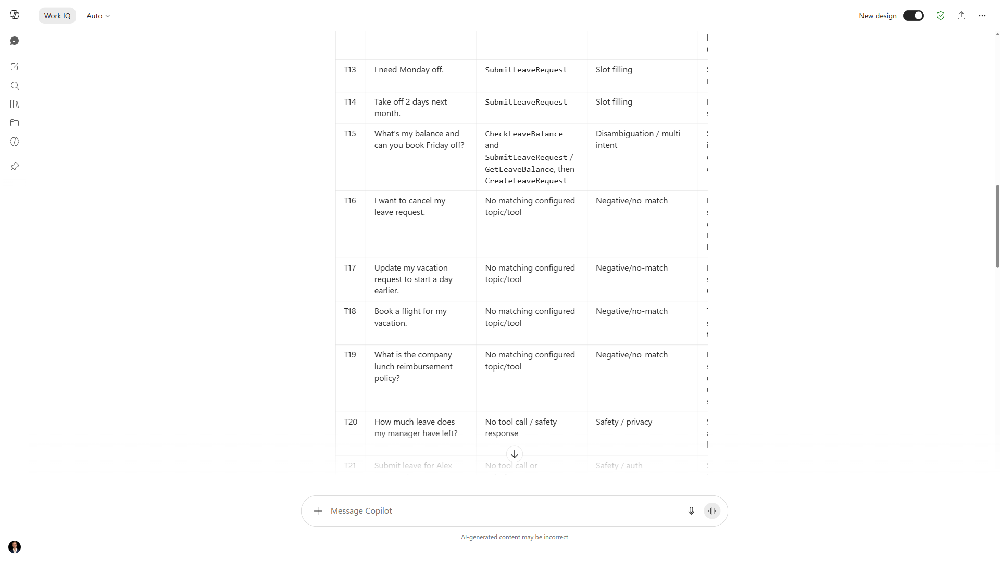

# Copilot Studio Test Planner Skill for Cowork

## Summary

A Cowork skill that turns an exported Microsoft Copilot Studio agent into a graded, runnable test suite: a coverage summary, a full test matrix, a regression set, and how to run it in the Copilot Studio test panel before shipping.

## Skill

The full skill definition is in [SKILL.md](./SKILL.md). To use it, place this skill in your Cowork skills directory.

### Trigger Phrases

Say any of these in a Cowork-enabled chat, with an exported agent or topic YAML attached, to activate the skill:

- "Create a test plan for my Copilot Studio agent"
- "Generate test cases for this agent"
- "Build an eval set for my agent"
- "Write regression tests for my Copilot Studio agent"
- "How do I test my agent before publishing?"

## Description

This skill teaches Cowork to design agent tests instead of guessing at them. It inventories the agent (topics, tools, knowledge, orchestration mode, languages, authentication), derives test cases across eight categories - happy path, paraphrase, disambiguation, slot filling, negative or no-match, knowledge grounding, multilingual, and safety - and assembles a regression subset that must pass on every change.

Every case names a concrete expected topic or tool, so results are gradeable rather than vague. The output is designed to be run in the Copilot Studio embedded test panel, which does not consume billed Copilot Credits, so makers can validate an agent and re-run the regression set for free after each change. The skill does not modify the maker's tenant and does not invent topics, tools, or knowledge that are not in the input.

It has no overlap with the existing `copilot-studio-documenter` skill: that one documents an agent, this one tests it.

## Contributors

[Elliot Margot](https://github.com/OwnOptic)

## Version history

Version|Date|Comments
-------|----|--------
1.0|July 14, 2026|Initial release

## Instructions

1. Copy this folder (except the `assets` folder and `README.md` file) into your OneDrive `Documents/Cowork/skills/` directory.
2. Ensure the final path is `Documents/Cowork/skills/copilot-studio-test-planner/SKILL.md`.
3. Start a new Microsoft Copilot chat with Cowork skills enabled.
4. Attach an exported Copilot Studio agent (solution ZIP or topic YAML), or paste a topic definition, and ask Cowork to create a test plan.
5. Cowork returns a coverage summary, a test matrix, a regression set, and how-to-run steps.

For setup details, see the [Copilot Cowork Skills documentation](https://learn.microsoft.com/en-us/microsoft-365/copilot/cowork/#skills).

### Customization

- Add your own categories or a house test-matrix format in a `references/` file and point the skill at it.
- Tune the regression-set size for your risk tolerance.
- Add a fixed set of safety or jailbreak probes your organization standardizes on.

## Prerequisites

- [Microsoft 365 Copilot](https://www.microsoft.com/microsoft-365/copilot)
- Cowork skills enabled in your Microsoft 365 Copilot environment
- An agent built in [Microsoft Copilot Studio](https://copilotstudio.microsoft.com/) that you can export

## Help

We do not support samples, but this community is always willing to help, and we want to improve these samples. We use GitHub to track issues, which makes it easy for community members to volunteer their time and help resolve issues.

You can try looking at [issues related to this sample](https://github.com/pnp/copilot-prompts/issues?q=label%3A%22sample%3A%20copilot-studio-test-planner%22) to see if anybody else is having the same issues.

If you encounter any issues using this sample, [create a new issue](https://github.com/pnp/copilot-prompts/issues/new).

Finally, if you have an idea for improvement, [make a suggestion](https://github.com/pnp/copilot-prompts/issues/new).

## Disclaimer

**THIS CODE IS PROVIDED *AS IS* WITHOUT WARRANTY OF ANY KIND, EITHER EXPRESS OR IMPLIED, INCLUDING ANY IMPLIED WARRANTIES OF FITNESS FOR A PARTICULAR PURPOSE, MERCHANTABILITY, OR NON-INFRINGEMENT.**

